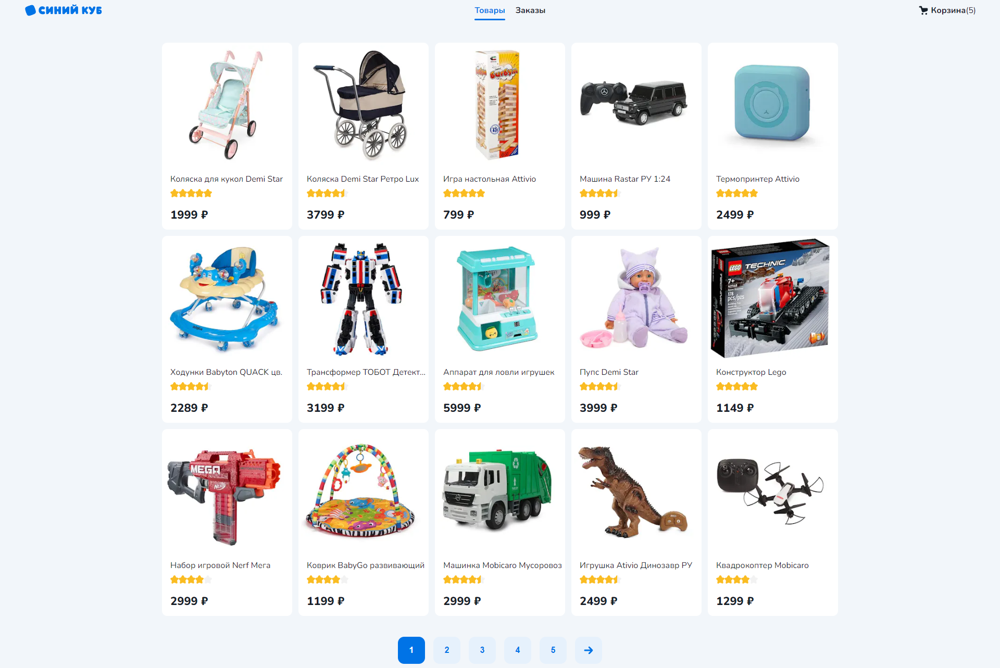
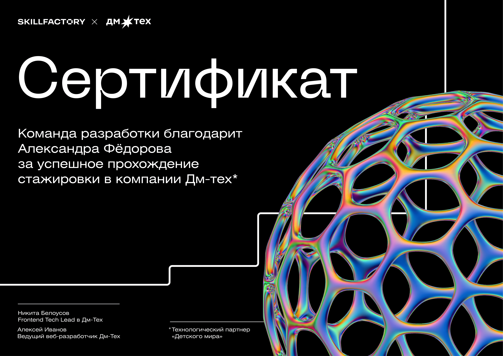

# Проект "Синий куб"

Этот проект является интернет-магазином, разработанным с использованием Next.js. Он позволяет просматривать товары, добавлять их в корзину и оформлять заказы.

## Описание проекта

Проект Синий куб предоставляет следующие функции:

- Листинг товаров с описанием и ценой.
- Добавление товаров в корзину и оформление заказа.
- Отображение страницы заказов для отслеживания статуса заказа.

## Структура проекта

Проект использует следующие технологии и инструменты:

- Frontend: Next.js, React, Redux Toolkit.
- Стилизация: CSS3 с препроцессором Sass.
- Взаимодействие с API: Axios для работы с сервером.
- Управление состоянием: Redux Toolkit для хранения данных о товарах и заказах.
- Оптимизация производительности: SSR и SSG для улучшения загрузки страниц.

## Установка и запуск проекта

Чтобы установить и запустить проект локально, выполните следующие шаги:

1. Клонируйте репозиторий на свой компьютер.
2. Установите зависимости с помощью команды `npm install` или `yarn install`.
3. Запустите разработческий сервер с помощью команды `npm run dev` или `yarn dev`.

Откройте [http://localhost:3000](http://localhost:3000) в браузере, чтобы увидеть результат.
